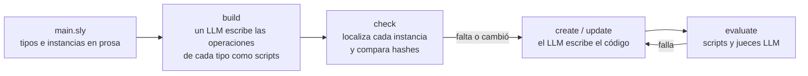

# Slyther

Slyther es un lenguaje para describir en prosa el código de un proyecto y un compilador que, con un LLM, mantiene ese código en línea con la descripción.



Cuando se le pide código a un modelo, la especificación queda en la conversación. Se commitea el código, no lo que se pidió, y cuando el requisito cambia hay que volver a pedirlo a mano. Los archivos de instrucciones como CLAUDE.md orientan al que escribe, pero nada comprueba que el resultado los cumpla, y un linter solo comprueba lo que se puede expresar como sintaxis. Una convención como "las funciones generales no van en un servicio, van a una clase de utilidades" se sostiene revisando a mano, cada vez.

Los agentes de código resuelven la escritura, no el mantenimiento. No saben qué partes del proyecto dependen de un requisito que cambió, así que o regeneran todo, que es caro y rompe lo que funcionaba, o no regeneran nada y la prosa y el código se separan en silencio.

Slyther trata la prosa como fuente y el código como salida: la especificación de cada pieza vive en el repositorio, sus reglas se verifican en cada build y solo se vuelve a escribir lo que cambió.

## Ejemplo

De [samples/services.sly](samples/services.sly), recortado:

```
@artifact service (requirements: string) {
    A single purpose service: one capability, one instance, consumed by others.

    1. It lives in `src/services/{id}.service.ts`, with its tests in `src/services/{id}.service.test.ts`
    2. Only static methods are allowed

    operation locate: deterministic {
        Prints src/services/{id}.service.ts and src/services/{id}.service.test.ts, one per line, and
        exits 0. Prints nothing and exits 1 when either does not exist.
    }

    operation evaluate {
        deterministic tests {
            Runs the cases of the .service.test.ts file. Exits 0 when they pass, 1 otherwise.
        }

        llm coverage {
            What the .service.test.ts file tests matches the requirements, and tests the behaviour that
            is expected of the service rather than what the code happens to do.
        }
    }
}

service Checkout {
    Processes the payment of an order and returns a receipt.
    The receipt carries the name of the customer formatted as a title.
}
```

## Cómo funciona

Un proyecto declara tipos de artefacto con sus reglas y sus operaciones, y después instancias de esos tipos. `build` le pide a un modelo que escriba cada paso determinista como script en TypeScript, Python o sh, lo ejecuta para verificarlo y lo devuelve a corregir si falla. Los scripts quedan commiteados en `.slyther/artifacts` y después corren sin modelo.

Para cada instancia, `locate` dice dónde está su código. Slyther compara el hash de su declaración, de lo que referencia, de su código y de las reglas con el del build anterior; lo que no cambió se conserva sin llamar al modelo. Lo que falta se crea, y lo que cambió se actualiza mostrando al modelo el diff de la prosa. Después se evalúa con los scripts y con jueces que no son la sesión que escribió, y si falla se corrige con los errores. Si una dependencia cambia, solo se reevalúa lo que usa la parte que cambió. `check` hace lo mismo sin tocar el código.

## Qué no hace

El único proveedor es la CLI de Claude, y cada instancia que cambia cuesta llamadas al modelo. La salida no es determinista y hay que revisarla. La prosa manda sobre el código, así que un cambio hecho solo en el código se vuelve a alinear con la prosa en el próximo `build`. No borra el código de instancias huérfanas. No conviene donde describir algo en prosa cuesta más que escribirlo, ni en proyectos que no quieran versionar `.slyther`.
