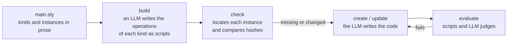

# Slyther

Slyther is a language for describing a project's code in prose, and a compiler that uses an LLM to keep that code in line with the description.



When you ask a model for code, the specification stays in the conversation. The code gets committed, what was asked for does not, and when the requirement changes someone has to ask again by hand. Instruction files like CLAUDE.md guide whoever writes, but nothing checks that the result follows them, and a linter only checks what can be expressed as syntax. A convention like "general purpose functions do not go in a service, they go in a utility class" holds only through manual review, every time.

Coding agents solve writing, not maintenance. They do not know which parts of a project depend on a requirement that changed, so either they regenerate everything, which is expensive and breaks what worked, or they regenerate nothing and the prose and the code drift apart silently.

Slyther treats the prose as source and the code as output: the specification of every piece lives in the repository, its rules are checked on every build, and only what changed is written again.

## Example

From [samples/services.sly](samples/services.sly), trimmed:

```
@artifact service (requirements: string) {
    A single purpose service: one capability, one instance, consumed by others.

    1. It lives in `src/services/{id}.service.ts`, with its tests in `src/services/{id}.service.test.ts`
    2. Only static methods are allowed

    operation locate: deterministic {
        Prints src/services/{id}.service.ts and src/services/{id}.service.test.ts, one per line, and
        exits 0. Prints nothing and exits 1 when either does not exist.
    }

    operation evaluate {
        deterministic tests {
            Runs the cases of the .service.test.ts file. Exits 0 when they pass, 1 otherwise.
        }

        llm coverage {
            What the .service.test.ts file tests matches the requirements, and tests the behaviour that
            is expected of the service rather than what the code happens to do.
        }
    }
}

service Checkout {
    Processes the payment of an order and returns a receipt.
    The receipt carries the name of the customer formatted as a title.
}
```

## How it works

A project declares kinds of artifact, with their rules and operations, and then instances of those kinds. `build` asks a model to write each deterministic step as a script in TypeScript, Python or sh, runs it to verify it, and sends it back to be fixed when it fails. The scripts are committed in `.slyther/artifacts` and from then on run without a model.

For each instance, `locate` says where its code is. Slyther compares the hash of its declaration, of what it references, of its code and of the rules against the previous build; what did not change is kept without calling the model. What is missing is created, and what changed is updated by showing the model the diff of the prose. It is then evaluated by the scripts and by judges that are not the session that wrote it, and when it fails it is fixed with the errors. When a dependency changes, only what uses the part that changed is evaluated again. `check` does the same without touching the code.

## What it does not do

The only provider is the Claude CLI, and every instance that changes costs model calls. The output is not deterministic and has to be reviewed. The prose rules over the code, so a change made only in the code is brought back in line with the prose on the next `build`. It does not delete the code of orphaned instances. It is not worth it where describing something in prose costs more than writing it, nor in projects that do not want to version `.slyther`.
